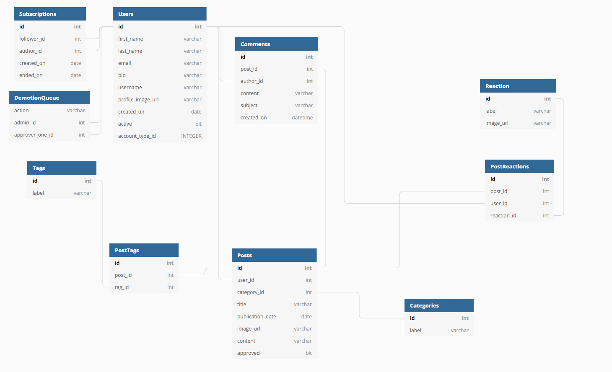
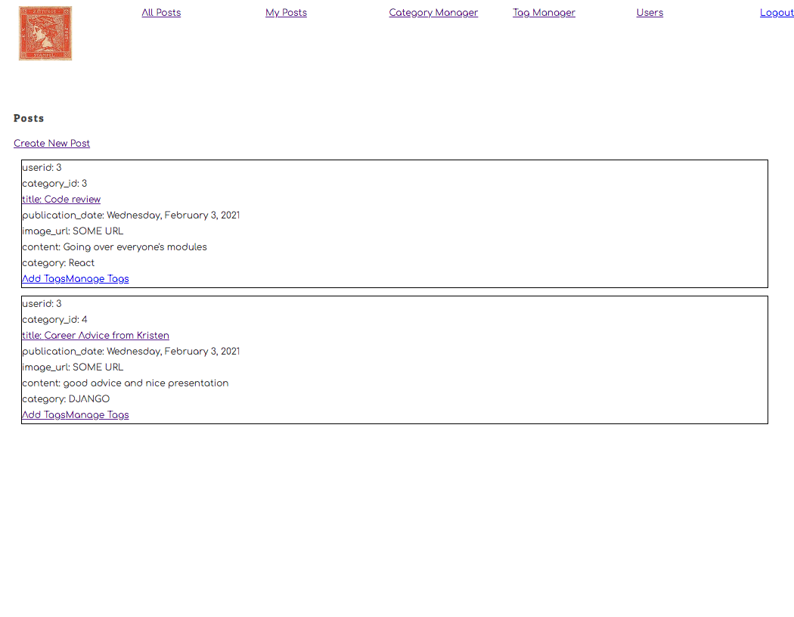

# RARE Publishing Platform Server in Python

> Nashville Software School Group Project for Rabid Sharks

## The Concept

This server code pairs with the Rare Publishing Platform React App which can be found here https://github.com/nss-day-cohort-44/rare-rabid-sharks

Rare App allows users to make, view, edit, and comment their own posts, as well as the posts of other users


RareServerERD.png

## Features

* Full CRUD endpoints for Users, Posts, Tags, Categories, Comments.
* Query endpoints to return data lists by various id categories.
* Access and control of database through SQLite statements.

## Setting Up Database

### Pulling down the Server-Side Repo. 
 
> Note: This project is meant to run simultaneously with the Client-Side Repo found here: https://github.com/nss-day-cohort-44/rare-rabid-sharks  
 
> Depending on which repo you start with, you may already have the following directories set up.  
> This project requires Python  
 
### To Begin installing the Server-Side Repo, complete the following steps: 
 
1. Create a directory from which to deploy the application. 
	
```mkdir RARE ```
 
2. Within RARE, create two sub-directories, CLIENT and SERVER 

```mkdir CLIENT ```
	
```mkdir SERVER ```
 
3. Navigate into the SERVER sub-directory. 
 
```cd CLIENT ```
 
4. Enter the following commands: 
	
```git clone git@github.com:nss-day-cohort-44/rare-rabid-sharks.git .``` <-- note the single 	
dot preceded by a single space.  
 
5. Create a virtual environment: 
```pipenv shell```

6. Once the virtual environment is created, install the 3rd-party software. 

```pipenv install autopep8 watchgod ```

7. Enter in the following command to start your new data server written in Python: 

```watchgod request_handler.main ```

> If there are no errors in the code, you will see the following, terse output:  
 
```watchgod request_handler.main [09:34:37] watching "/Users/.../workspace/python-server" and reloading "request_handler.main" on changes…``` 


## Screenshots




## A guided workflow, if it so interests you

1. Register a new account. **Do not use any sensitive credentials. This is not a secure application!** 
1. Make a post of your own or view other users posts and comment on them.
1. Edit or delete any of your own posts or comments.
1. Add, edit, or delete Categories for your posts.
1. Add, edit, or delete Tags for your posts.

## Technologies Used

This application was built using [Python] and [SQLite3]  

## Author

NSS Cohort 44 Rabid Sharks Team
